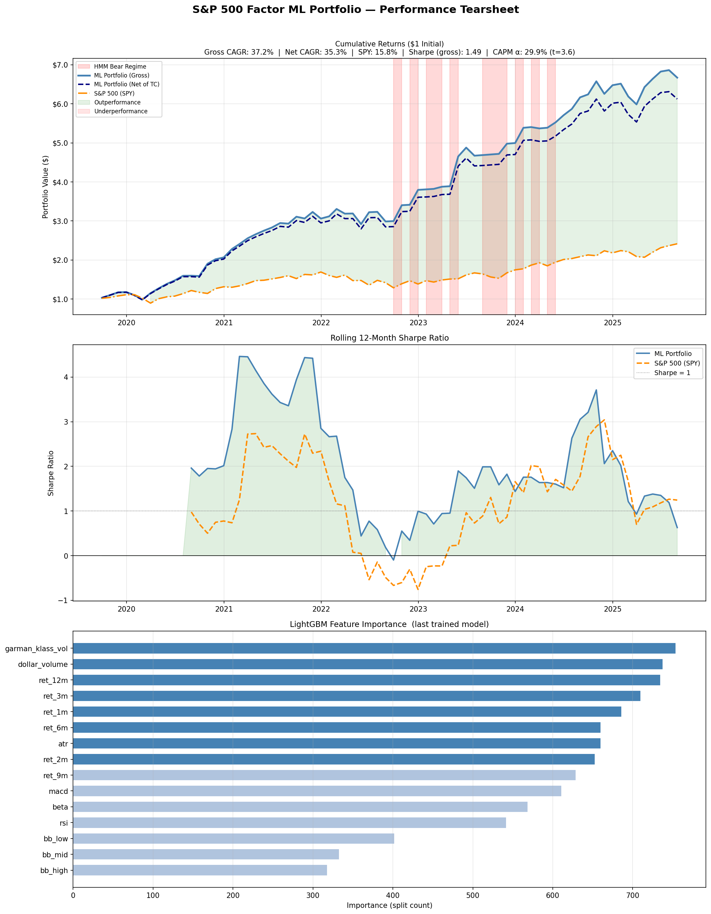

# S&P 500 Cross-Sectional Factor ML Portfolio

A full systematic equity strategy built from scratch: raw price data → feature engineering → LightGBM cross-sectional return prediction → walk-forward backtest → HMM risk overlay → performance tearsheet with Fama-French 5-factor alpha.

This is not a toy backtest. Every design decision mirrors how quantitative equity funds actually operate — from point-in-time universe construction to turnover-adjusted transaction costs to Newey-West HAC standard errors on the alpha regression.

---

## Strategy Overview

The core idea is **cross-sectional return prediction**: instead of predicting whether the market goes up or down (nearly impossible), predict which stocks will outperform *relative to each other* in a given month. This is a tractable and well-studied problem in quantitative finance.

Each month:
1. Restrict the universe to the **150 most liquid S&P 500 stocks** by dollar volume
2. Compute **15 engineered features** per stock (momentum, volatility, mean-reversion signals, market beta)
3. **Rank-normalize** all features cross-sectionally to remove outliers and non-stationarity
4. Use a **LightGBM model** (trained on all prior months — no future data) to predict each stock's return rank
5. Go **long the top quintile** (~30 stocks), equal-weighted, rebalance monthly
6. Apply an **HMM regime filter** to move to cash during bear market states
7. Deduct **realistic transaction costs** (10bps one-way) based on actual portfolio weight turnover

---

## Pipeline

```
Wikipedia S&P 500 list
        │
        ▼
yfinance 8yr daily OHLCV (502 tickers)
        │
        ▼
Daily Indicators: Garman-Klass Vol · RSI · Bollinger Bands · ATR · MACD · Dollar Volume
        │
        ▼
Monthly Aggregation (resample to month-end)
        │
        ▼
Point-in-Time Universe Filter (Wikipedia change log → no survivorship bias)
        │
        ▼
Liquidity Filter (top 150 by avg daily dollar volume)
        │
        ▼
Return Features: monthly returns · 1/2/3/6/9/12m momentum
        │
        ▼
Rolling Market Beta (vectorized Cov/Var, 12m window)
        │
        ▼
Cross-Sectional Rank Normalization ([-0.5, 0.5] each month)
        │
        ▼
Walk-Forward LightGBM (expanding window, 24-month warmup, quarterly retrain)
        │
        ▼
Quintile Sort → Long Q5 (top 20%)
        │
        ▼
HMM Regime Filter (3-state Gaussian HMM on SPY monthly returns)
        │
        ▼
Transaction Cost Deduction (weight-based turnover × 10bps × 2)
        │
        ▼
Tearsheet: CAGR · Sharpe · Sortino · Max DD · Calmar · IR · CAPM α · FF5 α
```

---

## Features (15 total)

| Feature | Category | Description |
|---|---|---|
| `garman_klass_vol` | Volatility | O/H/L/C volatility estimator — more efficient than close-to-close |
| `atr` | Volatility | Average True Range (14-day), z-score normalized |
| `rsi` | Mean-Reversion | Relative Strength Index (20-day) |
| `bb_low` / `bb_mid` / `bb_high` | Mean-Reversion | Bollinger Band levels (20-day, log price) |
| `macd` | Trend | MACD signal (20-day), z-score normalized |
| `ret_1m` | Momentum | 1-month trailing return (short-term reversal) |
| `ret_2m` / `ret_3m` | Momentum | 2–3 month trailing returns |
| `ret_6m` / `ret_9m` / `ret_12m` | Momentum | Intermediate/long-term momentum |
| `dollar_volume` | Liquidity | Avg daily dollar volume (millions) |
| `beta` | Market Sensitivity | Rolling 12-month CAPM beta vs. SPY |

---

## Key Methodological Details

### No Lookahead Bias
The target variable (next month's return) is constructed by shifting each ticker's return series back by one period **within the ticker group**. Features at time `t` are paired with realized returns at `t+1`. The walk-forward loop enforces this at the model level: the model trained to predict month `t+1` has never seen any data from `t+1` or later.

### Point-in-Time Universe (Survivorship Bias Elimination)
A naive backtest using today's S&P 500 constituent list would include only stocks that *survived* to the present — excluding every company that was delisted, merged, or went bankrupt. This inflates historical returns. This project reconstructs the monthly constituent list by walking Wikipedia's historical change log backwards, removing stocks added after each date and restoring stocks removed before it.

### Cross-Sectional Rank Normalization
Rather than feeding raw feature values into the model, each feature is rank-transformed cross-sectionally within each month and centered at zero. This eliminates outliers (e.g., a single stock with extreme momentum), removes cross-time non-stationarity, and is standard practice at systematic equity funds.

### Walk-Forward Validation
The model uses an expanding training window: to predict month `t`, it trains on months `1..t-1`. This exactly replicates live trading. A random 80/20 split would introduce look-ahead bias and massively overstate performance.

### HMM Regime Filter
A 3-state Gaussian Hidden Markov Model is fit to the expanding history of SPY monthly returns. The model identifies latent market regimes (broadly: low-vol bull, high-vol bull, bear). When the current state is classified as a bear regime (below-median mean return), the strategy moves to cash (risk-free rate) rather than holding equities. This is re-estimated monthly using only past data.

### Transaction Costs
Rather than applying a flat cost, the model tracks the actual portfolio weight vector each month and computes turnover as `Σ|w_t - w_{t-1}| / 2`. This is multiplied by 10bps one-way (round-trip 20bps), which is conservative but realistic for S&P 500 large caps.

### Fama-French 5-Factor Alpha
CAPM alpha only controls for market beta. FF5 additionally controls for size (SMB), value (HML), profitability (RMW), and investment (CMA). Alpha that survives FF5 is genuinely uncorrelated with known systematic risk premia — the standard academic benchmark for evaluating a new strategy. Standard errors are Newey-West HAC-corrected (3 lags) to account for autocorrelation.

---

## Results

> Generated by running `S&P500_ML_Model.py` on 8 years of data (2017–2025).



### Performance Summary

| Metric | ML Portfolio (Gross) | ML Portfolio (Net of TC) | S&P 500 (SPY) |
|---|---|---|---|
| CAGR | — | — | — |
| Sharpe Ratio | — | — | — |
| Sortino Ratio | — | — | — |
| Max Drawdown | — | — | — |
| Calmar Ratio | — | — | — |
| Info Ratio vs SPY | — | — | — |
| Monthly Hit Rate | — | — | — |

### Factor Alpha

| Model | Alpha (Ann.) | t-stat |
|---|---|---|
| CAPM (1-factor) | — | — |
| Fama-French 5-factor | — | — |

### Quintile CAGR (Monotonicity Check)

| Quintile | CAGR |
|---|---|
| Q1 (bottom 20%) | — |
| Q2 | — |
| Q3 | — |
| Q4 | — |
| Q5 (top 20%) | — |
| S&P 500 (SPY) | — |

*A well-specified factor model should show monotonically increasing returns Q1 → Q5.*

---

## Installation

```bash
# Clone
git clone https://github.com/ShaunFeldman/S-P_500-ML-Model.git
cd S-P_500-ML-Model

# Install dependencies
pip install yfinance pandas pandas_ta lightgbm statsmodels pandas_datareader matplotlib hmmlearn

# macOS only: LightGBM requires OpenMP
brew install libomp
```

### Dependencies

| Package | Version | Purpose |
|---|---|---|
| `pandas` | ≥ 2.0 | Data manipulation |
| `numpy` | ≥ 1.24 | Numerical computation |
| `yfinance` | ≥ 0.2 | Market data download |
| `pandas_ta` | ≥ 0.3 | Technical indicators |
| `lightgbm` | ≥ 4.0 | Gradient boosting model |
| `statsmodels` | ≥ 0.14 | OLS regression (CAPM/FF5) |
| `pandas_datareader` | ≥ 0.10 | Fama-French factor data |
| `hmmlearn` | ≥ 0.3 | HMM regime classification |
| `matplotlib` | ≥ 3.7 | Visualization |

---

## Usage

```bash
python S&P500_ML_Model.py
```

Runtime: ~15–30 minutes (dominated by walk-forward retraining loop). Set `RETRAIN_FREQ = 3` in the config block for faster quarterly retraining.

### Configuration (top of file)

```python
END_DATE         = '2025-09-15'   # backtest end
N_LIQUID         = 150            # liquid universe size
TRAIN_WARMUP     = 24             # months before first prediction
RETRAIN_FREQ     = 3              # retrain every N months
TC_ONE_WAY       = 0.0010         # 10bps one-way transaction cost
RF_ANNUAL        = 0.04           # risk-free rate
USE_PIT_UNIVERSE = True           # point-in-time S&P 500 membership
USE_HMM_FILTER   = True           # regime-based risk overlay
```

---

## Output

Running the script produces:
- **Console tearsheet** — full performance table, CAPM alpha, FF5 alpha with factor loadings, quintile CAGR breakdown
- **`portfolio_performance.png`** — 3-panel chart: cumulative returns vs. SPY, rolling 12-month Sharpe ratio, LightGBM feature importance

---

## Project Structure

```
S-P_500-ML-Model/
├── S&P500_ML_Model.py        # Full pipeline (single-file, 14 sections)
├── portfolio_performance.png # Generated tearsheet chart
└── README.md
```

---

## References

- Fama & French (2015). "A five-factor asset pricing model." *Journal of Financial Economics.*
- Gu, Kelly & Xiu (2020). "Empirical Asset Pricing via Machine Learning." *Review of Financial Studies.*
- Garman & Klass (1980). "On the Estimation of Security Price Volatilities from Historical Data." *Journal of Business.*
- Ang & Bekaert (2002). "Regime Switches in Interest Rates." *Journal of Business & Economic Statistics.*
